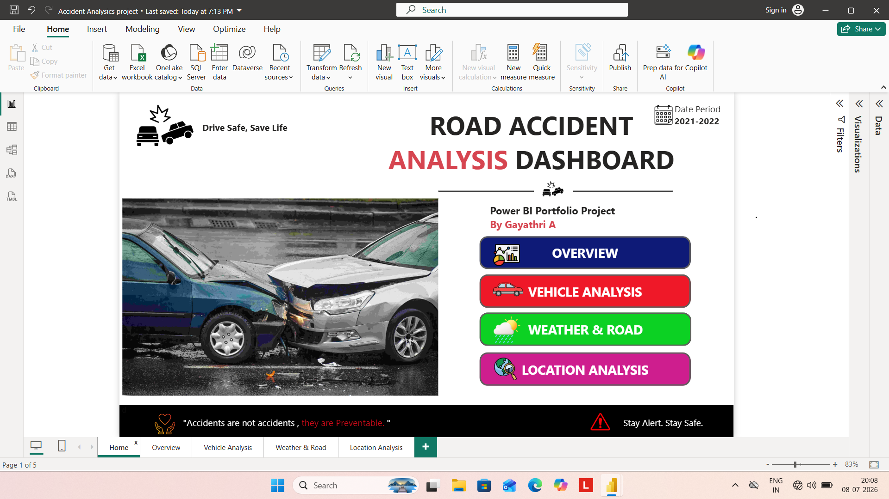
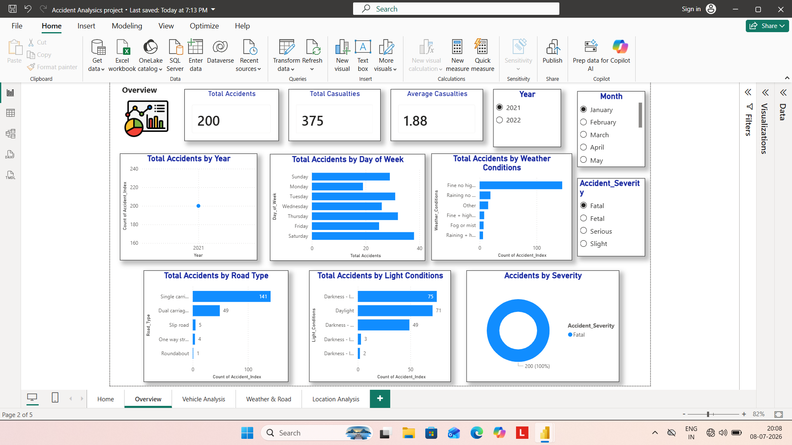
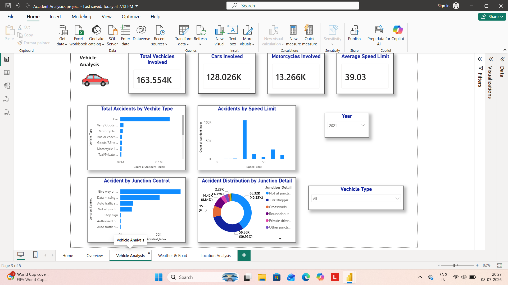
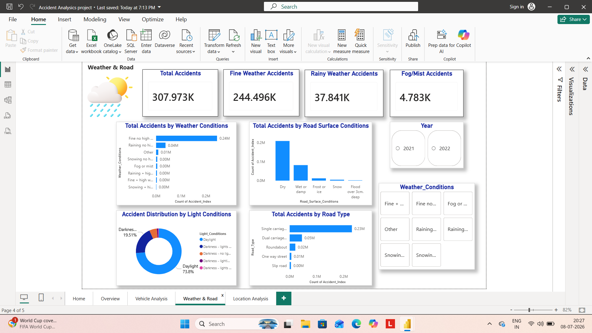
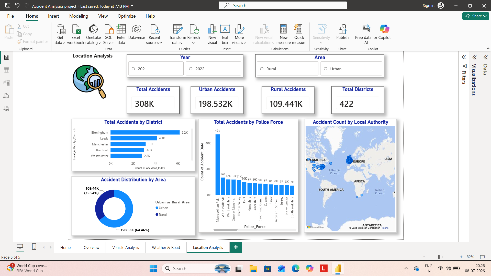

# Road Accident Analysis Dashboard – 2021–2022

## About the Project

This project is an interactive Road Accident Analysis Dashboard created using Microsoft Power BI. It analyzes road accident data for the period 2021–2022 and presents insights through interactive charts, KPI cards, and slicers.

## Tools Used

- Microsoft Power BI
- DAX
- Data Cleaning
- Data Visualization

## Key Features

- 2021–2022 road accident analysis
- Accident severity analysis
- Vehicle-wise accident analysis
- Weather and road condition analysis
- Location-wise accident analysis
- Year and month filtering
- Interactive slicers
- KPI cards and charts

## Dashboard Pages

1. Home
2. Overview
3. Vehicle Analysis
4. Weather & Road
5. Location Analysis

## Dashboard Preview

### Home

### Overview

### Vehicle Analysis

### Weather & Road

### Location Analysis

## Project Files

- `Accident Analysis project.pbix` – Power BI dashboard file
- `Road_Accident_Analysis_2021-2022.pdf` – Exported dashboard PDF
- PNG files – Dashboard screenshots

## Project By

**Gayathri A**
